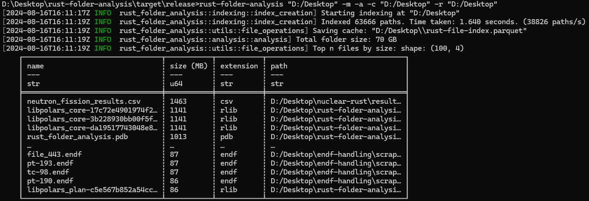

# Rust File Indexing 


A simple Rust-based command-line tool for recursively indexing all files and folders in a given directory, similar to WinDirStat or SequoiaView (but less pretty). The tool by default collects metadata (this can be disabled for faster indexing), saving the results to a `parquet`-file (faster than CSV, and easily readable with Pandas). Additionally, Polars can be used to provide analysis on the folders and files found, creating a set of human-readable CSVs with folder sizes, common extensions etc. 



The main idea is to be very fast. The code uses parallel processing with a thread pool, indexing 342.000 paths in 6.5s on an SSD (53.000 paths/s). 

## Features

1. **Indexing**: Recursively index all files in a specified directory.
2. **Caching**: Saving the index data to a Parquet file for later use.
3. **Metadata**: Option to include file metadata in the index, such as size, creation date, etc. 
4. **File hashing**: computes a SHA256 hash per file, saving that to the cache, and computes the overall hash for the entire folder. 
4. **Post-Indexing Analysis**: After indexing, run a Polars-based analysis on the data and save the results as CSV files.
    - Top-100 files by size. 
    - Total file size per extension. 
    - Extension counts. 
    - Largest folders found. 

## Installation 

Simply clone the repo and run ```cargo build --release```. This will generate the executable under ```target/release/rust-folder-analysis.exe```, from where it can be called. 

## Options

- **`[index_path]`**:  
  **Description**: The root folder path from where the recursive indexing will start.  
  **Usage**:  
  ```bash
  cargo run -- /path/to/folder
  ```

- **`-c, --cache_location`**:  
  **Description**: Specifies the location to save the Parquet cache file. If not provided, the cache will be saved in the directory where the executable is located.  
  **Usage**:  
  ```bash
  cargo run -- /path/to/folder -c /path/to/cache/location
  ```

- **`-m, --metadata`**:  
  **Description**: If this flag is set, the tool will include metadata (e.g., file size, modification date) in the index. Note that this operation might be slower.  
  **Usage**:  
  ```bash
  cargo run -- /path/to/folder -m
  ```

- **`-a, --analysis`**:  
  **Description**: Enables post-indexing analysis on the data using Polars. The analysis results are saved as CSV files.  
  **Usage**:  
  ```bash
  cargo run -- /path/to/folder -a
  ```

- **`-H, --hash`**:  
  **Description**: Calculates hashes for each individual file. This can be _slow_: it has to read through every single file. It uses a buffered method so memory usage is still low, however. Requires analysis and metadata options.  
  **Usage**:  
  ```bash
  cargo run -- /path/to/folder -a -m -H
  ```

- **`-r, --analysis_folder`**:  
  **Description**: Specifies the folder where the analysis result CSV files will be saved. If not provided, the results will be saved in the directory where the executable is located.  
  **Usage**:  
  ```bash
  cargo run -- /path/to/folder -a -r /path/to/analysis/results
  ```

### Example usage 

- **Basic indexing**:  
  ```bash
  cargo run -- /path/to/folder
  ```

- **Indexing with metadata**:  
  ```bash
  cargo run -- /path/to/folder -m
  ```

- **Indexing with metadata and analysis**:  
  ```bash
  cargo run -- /path/to/folder -m -a -r /path/to/analysis/results
  ```
